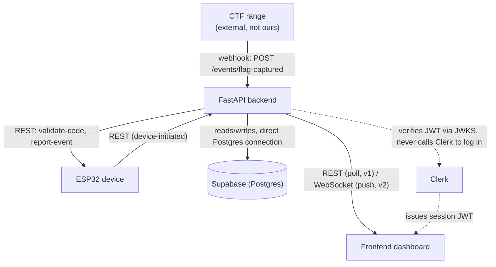
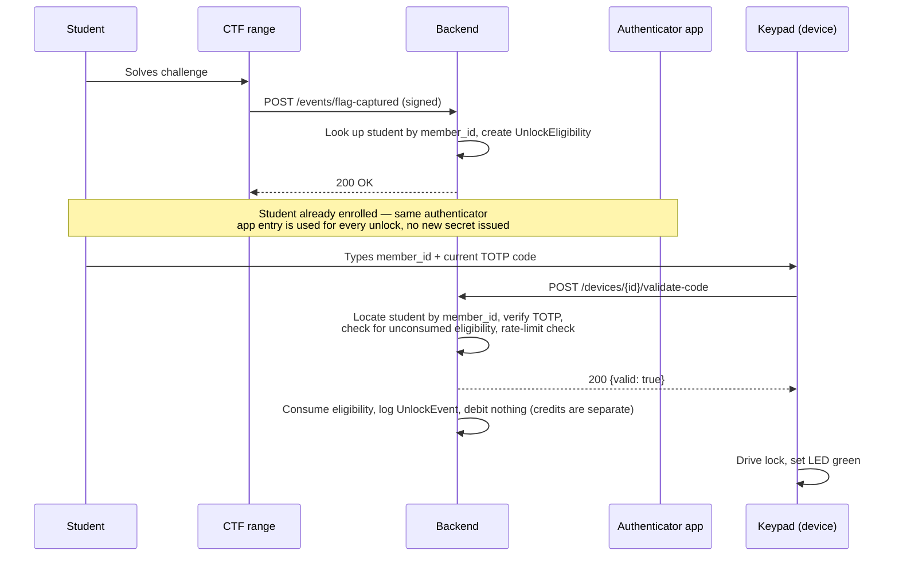
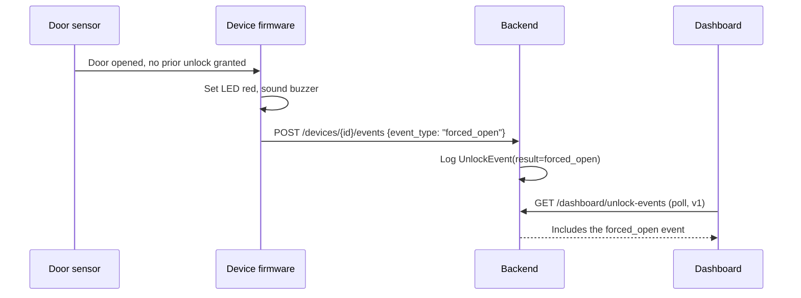

# Architecture

## 1. System overview

Four components, one source of truth. The backend is the only component with database
access — the ESP32 device and the frontend dashboard both go through it, never to each
other directly, and never to the database directly.

## 2. Components

### 2.1 Backend (FastAPI)

Owns all business logic and all state. Responsibilities:

- Validate unlock codes submitted by the device (TOTP check, eligibility check, rate limiting)
- Receive and process flag-capture webhooks from the CTF range
- Maintain the credit ledger and item redemption logic
- Serve the admin dashboard (auth, unlock history, student management, device status)
- Log every unlock attempt and device-reported event (forced-open, heartbeat) for audit

It is the only component that talks to the database directly. Nothing else gets a
connection string — **including the frontend**, even though Supabase makes it easy to bypass
the backend and query Postgres straight from the browser via its auto-generated API. Don't.
The eligibility-consumption and rate-limiting logic in `validate-code` has to run somewhere
trusted and atomic; a client-side Supabase query can't enforce that. Supabase here is just a
managed Postgres instance the backend happens to connect to — none of Supabase's own Auth,
client-side row-level-security model, or auto-API are in use. The one exception, noted in §6,
is read-only Realtime subscriptions for the dashboard, which is a deliberate, scoped carve-out
from this rule, not a reversal of it.

It also verifies (never issues) Clerk session JWTs for every admin-facing request — see
`API_SPEC.md` § Auth for the verification approach.

### 2.2 ESP32 device (firmware)

Owns the physical interaction: reading the keypad, driving the lock actuator, the LED
strip, the OLED, and the buzzer. It holds **no student data and no TOTP secrets** — it is a
dumb terminal that forwards a code string to the backend and acts on the response. This is
deliberate: if a device is physically compromised, nothing on it should let an attacker
derive anyone's TOTP secret or produce a valid code for a different device.

State the firmware tracks locally: `armed | unlocking | forced_open`, plus whatever it
needs to debounce the keypad and door switch. Nothing else.

### 2.3 Frontend dashboard

Admin-facing only in v1 — this is not a student-facing app. Students interact with the
system entirely through their authenticator app and the physical keypad. The dashboard is
where the instructor manages students, reviews unlock history, and configures items.

### 2.4 CTF range (external)

Not built by this team. Treated as an untrusted external system whose webhook calls must
be signature-verified (see §5). The actual payload shape must be confirmed with whoever
operates the range — the shape assumed in this document is a placeholder until that
contract is confirmed; see ADR pending in `DECISIONS.md`.

## 3. Core data flow: solving a challenge to unlocking the fridge

## 4. Forced-open alert path

## 5. Security model

This device's own user population is a cybersecurity club. Threat modeling isn't optional
here — see the "problems" discussion this team already had about this. Controls in this
architecture:

| Threat | Control |
|---|---|
| Brute-forcing the 10-digit code (member_id + TOTP) | Rate limit on `validate-code` per device (default 5/min, see `RATE_LIMIT_PER_MINUTE`); lock out a device for a cooldown period after repeated failures |
| Replaying a captured code | TOTP codes are single-window valid (30s) and each eligibility is single-use — consuming it invalidates it even if the same code is resubmitted |
| Sniffing device↔backend traffic | HTTPS only; device authenticates with a per-device API key sent over TLS |
| A compromised device's API key being reused elsewhere | Keys are scoped per device_id and rate-limited per device_id, not globally — one compromised device doesn't grant network-wide access |
| Forging a flag-capture webhook | HMAC signature over the payload using `RANGE_WEBHOOK_SECRET`, verified before processing; requests without a valid signature are rejected with 401 and not processed |
| Reading TOTP secrets out of the database | Secrets are encrypted at rest (`TOTP_ENCRYPTION_KEY`, Fernet); a raw database dump does not yield usable secrets without the key, which is not stored in the same place as the database |
| A student's TOTP code being shared with a non-enrolled friend | Out of scope for the backend to prevent — this is a social/policy problem, not a technical one. Worth stating explicitly rather than pretending the system solves it. |
| A stolen admin session (Clerk JWT) | Short Clerk session lifetime plus Clerk's own revocation on sign-out; the backend does no password handling at all, so there's no local credential store to leak |
| Frontend querying Supabase directly and bypassing backend business logic | Disallowed by convention for writes (§2.1); for the one permitted Realtime read path (§6), enforced by Postgres Row Level Security policies, not by hoping the frontend behaves |

## 6. Realtime update strategy

v1 ships with dashboard polling (`GET /dashboard/unlock-events`, `GET /devices/{id}/state`
every 3-5s from the frontend). `API_SPEC.md` also specifies a custom `/ws/dashboard`
WebSocket as a v2 option — but now that the database is Supabase, **Supabase Realtime is the
stronger v2 candidate** and should be preferred over building a custom WebSocket server: it
subscribes the frontend directly to Postgres row changes (via logical replication) on
`unlock_event` and `device` with no additional backend code to maintain. See ADR-006 and
ADR-003 in `DECISIONS.md` for the reasoning and the one real cost — it's a client reading
straight from the database, which is the single exception to the "only the backend touches
the DB" rule in §2.1, and it requires actual Row Level Security policies (e.g. "authenticated
Clerk users can SELECT from unlock_event, no one can INSERT/UPDATE/DELETE via this path") to
be safe. Don't enable it without writing those policies first — an RLS-less Realtime
subscription on a table with student data is a data leak, not a feature.

Either v2 path is still deferred: don't build it until v1 polling is demonstrated working.

## 7. Deployment (target shape, not yet built)

The database is no longer self-hosted — Supabase owns backups, point-in-time recovery, and
connection pooling for it, which removes a whole category of work this team would otherwise
have had to do themselves. What's left to deploy is just the FastAPI backend and, if it's a
separate service, the frontend. A single small VM or a basic PaaS deployment (Render, Fly.io,
Railway) is sufficient for this project's scale — there's still no case for Kubernetes here,
and Supabase being managed infrastructure makes that even more true than it already was.
