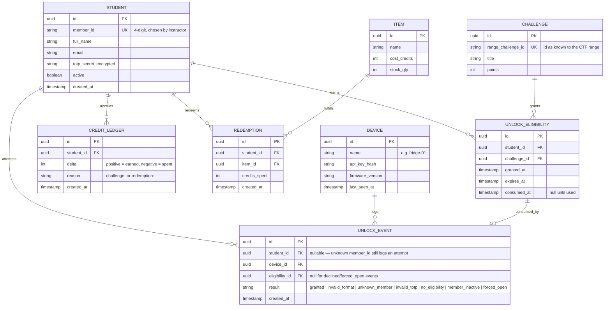

# Data model

## Notes on specific fields

**`STUDENT.totp_secret_encrypted`** — encrypted with `TOTP_ENCRYPTION_KEY` (Fernet) before
storage, decrypted only in-memory at validation time, never logged, never included in any
API response after the initial enrollment call. If you find yourself adding this field to a
response schema anywhere outside `POST /students` and `POST /students/{id}/reset-totp`,
that's a bug.

**`UNLOCK_ELIGIBILITY.expires_at`** — configurable window, default 1 hour from `granted_at`.
A background job (or a check at validation time — either is acceptable for this scale)
should treat expired-but-unconsumed eligibilities as invalid without needing a cron job to
delete them; a status derived from `now() > expires_at` is simpler than a scheduled task for
a system this size.

**`UNLOCK_EVENT.student_id` is nullable** — a code submitted with an unrecognized
`member_id` still needs to be logged for audit/security purposes, but there's no student
row to attach it to. Don't make this field required and then either drop unknown-member
attempts silently or invent a placeholder student row — nullable is the honest model here.

**Credit policy (`delta` calculation)** — store the conversion rate (e.g. `points // 10`) as
a configuration value, not a hardcoded constant buried in a service function. The client
will very likely want to change this number after seeing it in practice, and it shouldn't
require a code deploy to do it.

## Clerk and Supabase notes

There is no `ADMIN_USER` table above, and that's intentional, not an oversight — Clerk owns
instructor/admin identity entirely. If an action needs to record who performed it (creating
an item, resetting a student's TOTP secret), store Clerk's user id (the JWT's `sub` claim) as
a plain string field on that record, e.g. `performed_by_clerk_user_id`. Don't create a local
mirror table of Clerk users — it will drift out of sync and there's no reason to maintain it.

This schema is plain Postgres and needs no changes to run on Supabase. The one thing to set
up in the Supabase dashboard rather than in a migration: Row Level Security policies on
`unlock_event` and `device` if Supabase Realtime is adopted per `ARCHITECTURE.md` §6 — the
backend's own connection uses the Postgres service role and bypasses RLS by design (it's a
trusted server), but any table a browser client subscribes to directly must have RLS enabled
with an explicit policy, or every authenticated Supabase client can read every row in it.

## Indexes

At minimum: unique index on `student.member_id`, unique index on `challenge.range_challenge_id`,
composite index on `unlock_eligibility(student_id, consumed_at)` for the "find this
student's unconsumed eligibility" lookup that runs on every unlock attempt — this is the
hottest query path in the system and should not be doing a table scan.
